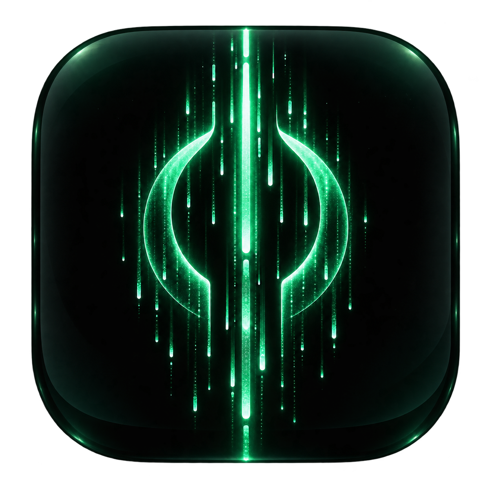
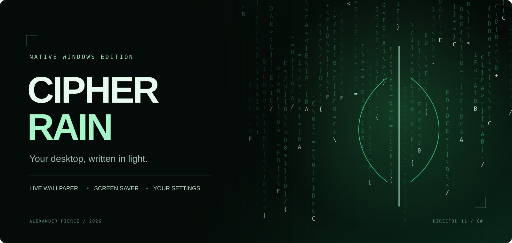

<p align="center">
  
</p>

<h1 align="center">Cipher Rain for Windows</h1>
<p align="center"><strong>Your desktop, written in light.</strong></p>
<p align="center">A native Windows 11 live wallpaper and screen saver by Alexander Pierce.</p>
<p align="center"><a href="https://github.com/est1994ap-del/cipher-rain-windows/releases">Download for Windows</a> · <a href="INSTALL.md">Install & use</a> · <a href="docs/QA%20Report.md">Test results & limits</a> · <a href="LICENSE.txt">MIT license</a></p>



*Banner artwork; the live application renders its own rain and effects.*

Cipher Rain brings flowing symbols, luminous trails, and timed visual effects to your Windows desktop. Shape the rain in a live settings preview, add a custom title and console boot sequence, and let it continue across your displays. Your changes save automatically. Optional startup brings back your last saved look when you sign in.

**Windows 11 x64 · Free and open source · Works offline · No account required**

## Which download should I choose?

Get the files from [GitHub Releases](https://github.com/est1994ap-del/cipher-rain-windows/releases), not the green **Code → Download ZIP** button. That button downloads the developer source, not the ready-to-run app.

| Download | Best for | What to do |
| --- | --- | --- |
| **Cipher.Rain.Setup.exe** | Most people | Open it and choose **Install & open**. Includes the custom desktop icon and an uninstaller. |
| **Cipher.Rain.Portable.zip** | Running from an extracted folder | Extract **all** files, then open `CipherRain.exe`. Keep the folder together. |
| **SHA256SUMS.txt** | Checking a download's integrity | Compare the file's SHA-256 checksum with the published value. |

Both app downloads include the .NET runtime. Neither requires Visual Studio or the .NET SDK. This release targets Intel/AMD x64 PCs, not native Windows ARM, macOS, or Linux.

**Unsigned first release:** Windows may show an unknown-publisher warning or block it under stricter security policies. Do not disable Smart App Control, antivirus, Secure Boot, or other protections to run it. A matching checksum confirms file integrity; it does not provide a trusted publisher signature. See [the installation guide](INSTALL.md).

## Make the rain yours

| Control | What you can do |
| --- | --- |
| **Six character styles** | Choose Classic, Narrow, Terminal, Operator, Dense, or Legacy. |
| **Four palettes** | Emerald Green, Acid Green, Ice Blue, and Amber. |
| **Four appearance presets** | Start with Balanced, Cinematic, Overclocked, or Battery Saver, then fine-tune. |
| **Rain & glow** | Adjust symbol size, density, speed, trail length, brightness, tracers, and color variation. |
| **Nine procedural effects** | Déjà Vu, moving burst, still burst, trace burst, small bursts, stored code drops, lightning, light sweep, and system glitch. |
| **Title & boot** | Write a title of up to three lines, control its timing, and preview the console boot sequence. |
| **Everyday controls** | Start, pause, resume, stop, and reopen settings from the notification-area icon. |
| **Windows integration** | Multiple displays, optional startup at sign-in, screen saver, and still-image export. |

Effects have individual timing controls and manual previews. Seamless mode lets the underlying rain keep moving. Choose 24, 30, or 60 frames per second; battery conservation and covered-desktop pausing help reduce activity when the wallpaper is not needed.

## Get started

**Requires Windows 11 x64 and graphics hardware that supports Direct3D 11.** Releases include the .NET runtime, so users do not need to install the SDK.

1. Open [Releases](https://github.com/est1994ap-del/cipher-rain-windows/releases) and download **Cipher.Rain.Setup.exe**.
2. Run it and choose **Install & open**.
3. Open the **Cipher Rain** desktop shortcut to adjust the appearance. Changes save automatically; closing the settings window leaves the wallpaper running.
4. In **Windows**, enable **Start Cipher Rain when I sign in** if you want it to begin automatically. It starts in the background with your saved settings. Changing an appearance preset keeps this preference.

Prefer a portable copy? Download **Cipher.Rain.Portable.zip**, extract the entire archive, and open `CipherRain.exe`. Keep all extracted files together. Portable and installed editions share the same local settings.

The current release is unsigned. See [INSTALL.md](INSTALL.md) for installation, screen-saver setup, and uninstall instructions.

### Know what each control does

- **Start desktop** puts the animated rain behind your desktop icons.
- **Pause / Resume** freezes the animation or lets it continue.
- **Stop** removes the animated desktop and reveals your normal wallpaper.
- **Close settings** leaves Cipher Rain available in the notification area near the Windows clock.
- **Quit Cipher Rain**, in that notification-area menu, closes the app entirely.

The Windows lock/sign-in screen can use an exported **still image**, not the live animation.

### Custom artwork

The original Cipher Rain icon is included in the application and installer. You can also view the [PNG logo](docs/media/CipherRain.png) and [Windows ICO file](src/CipherRain/Assets/CipherRain.ico).

## Local by design

Cipher Rain has no network service or telemetry. Settings and per-display continuity files stay in `%LOCALAPPDATA%\CipherRain`. Import and export let you keep a copy of your configuration. Public packages generate symbols from installed Windows fonts and do not include the owner's private reference glyphs or personal profile. Read [PRIVACY.md](PRIVACY.md).

The live wallpaper runs behind desktop icons. **Stop** removes Cipher Rain's desktop surfaces and reveals your ordinary wallpaper. Windows controls the secure sign-in screen; Cipher Rain supports a static image export for that screen. The screen saver follows the existing Windows sign-in policy.

## Build from source

Install the **.NET 8 SDK** on Windows 11 x64. The Visual Studio IDE is optional.

```powershell
dotnet restore src/CipherRain/CipherRain.csproj
dotnet build src/CipherRain/CipherRain.csproj -c Release
New-Item artifacts -ItemType Directory -Force | Out-Null
& './src/CipherRain/bin/Release/net8.0-windows/CipherRain.exe' --test './artifacts/Core Tests.json'
```

To create the self-contained portable archive and setup program:

```powershell
.\Build-Release.ps1
```

The release script builds the application payload before the setup project embeds it. Use the application project command above for an ordinary development build. Package restore and runtime publishing require an internet connection; the installed application works locally.

### How it is built

C# and **.NET 8** power the app; **WPF** provides settings, while **Direct3D 11 and HLSL**, accessed through **Vortice 3.6.2**, render the rain. Each display has a separate wallpaper process, and the settings preview has its own graphics thread. The Windows desktop attachment is isolated in `Native.cs` so shell compatibility changes can be addressed in one place.

| Area | Source |
| --- | --- |
| Saved settings and presets | `src/CipherRain/Settings.cs` |
| Rain, title, and effects | `Simulation.cs`, `Sequences.cs`, `Storm.cs` |
| Graphics and symbols | `Renderer.cs`, `GlyphAtlas.cs`, `Shaders/Rain.hlsl` |
| Desktop and screen-saver lifecycle | `Native.cs`, `RenderHost.cs` |
| Settings and notification-area controls | `Controller.cs`, `SettingsWindow.cs` |
| Installer and uninstaller | `src/Setup` |

## Verification

The first [GitHub-hosted Windows build](https://github.com/est1994ap-del/cipher-rain-windows/actions/runs/37668793076) passed on October 7, 2026: it rebuilt the self-contained packages and passed all 39 core checks. This verifies the public source builds independently; it is not a clean-PC installation or graphics/hardware certification.

The application was built and exercised on Windows 11 with four displays, using NVIDIA RTX 3090 and RTX 3050 adapters. The recorded checks include **39 core checks**, desktop start/stop and pause behavior, graphics captures for all nine effects, screen-saver transitions, installation/uninstall, and **12 startup and settings-persistence checks**.

[The QA report](docs/QA%20Report.md) explains the observations and their limits. Extended endurance testing, a clean Windows VM install, and several physical hardware transitions remain release checks. Exact pixel-for-pixel equivalence to the macOS reference is not claimed. Desktop attachment uses a Windows shell compatibility technique that may need updates as Windows changes.

## Documentation & contribution

- [Installation and everyday use](INSTALL.md)
- [Release notes](RELEASE-NOTES.md)
- [Privacy](PRIVACY.md)
- [Third-party licenses](LICENSES.md)
- [Verification report](docs/QA%20Report.md)

When reporting a problem, include your Windows version, display layout, graphics adapter, what you expected, and what happened. Remove personal titles and private data before sharing settings or logs.

## License

Copyright © 2026 Alexander Pierce. Cipher Rain's Windows application is available under the [MIT license](LICENSE.txt). Third-party components retain their own notices in [LICENSES.md](LICENSES.md) and `docs/Third Party Notices`.
