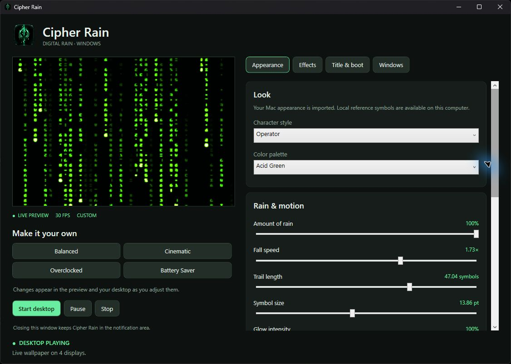
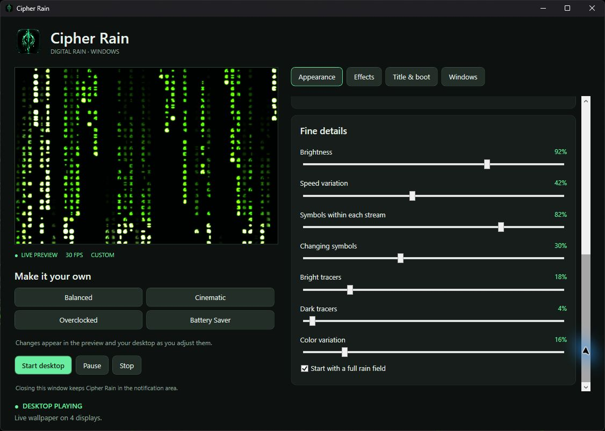
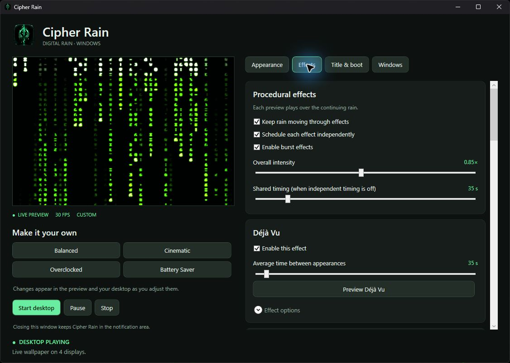
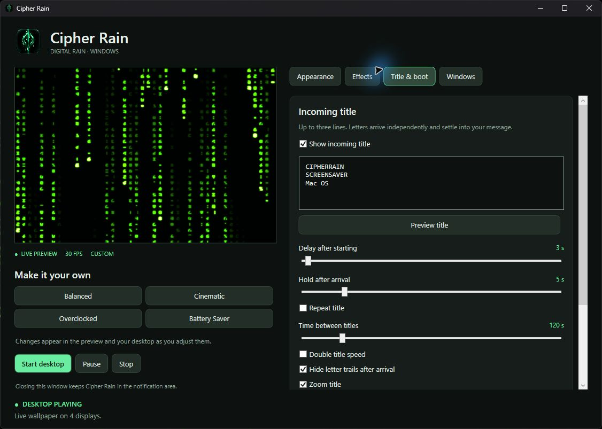
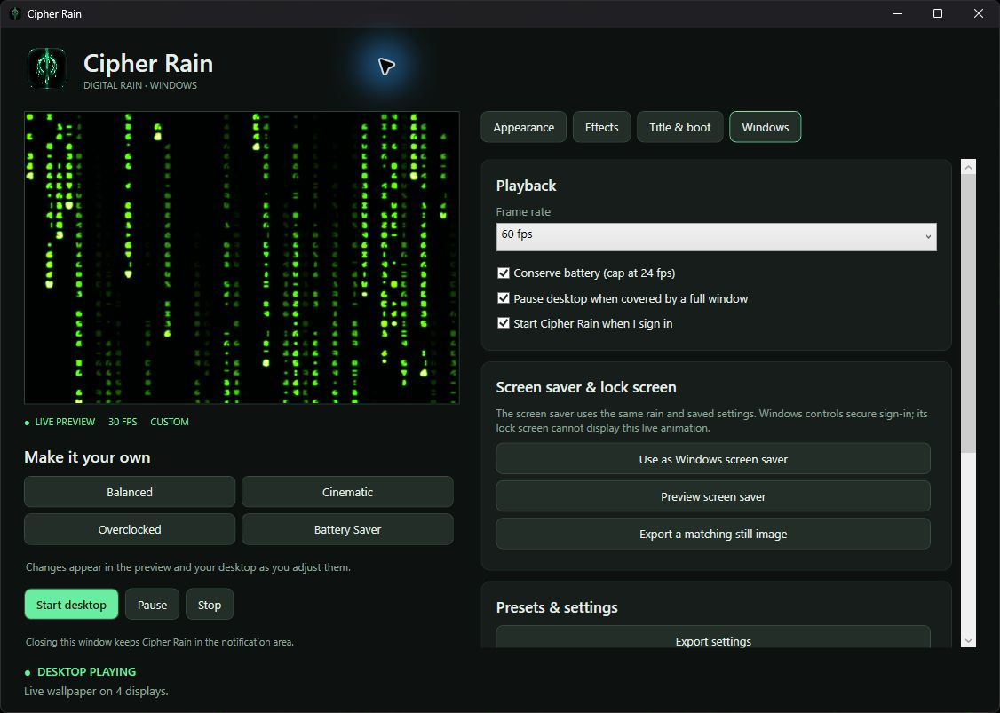

# Cipher Rain: settings explained

[Download the app](https://github.com/est1994ap-del/cipher-rain-windows/releases) · [Installation guide](../INSTALL.md) · [Back to the project](../README.md)

Cipher Rain is inspired by the falling green code in **The Matrix movies**. It turns that visual idea into a customizable Windows live wallpaper and screen saver. It is an independent, fan-inspired project—not official Matrix software or an affiliated film product.

The preview on the left stays live while you adjust settings on the right. Most changes appear in the preview and the active desktop automatically, and settings save automatically. Scroll inside the right-hand pane to reach the controls below the visible area.

## Start here

1. Choose **Balanced** or **Cinematic** for a starting look.
2. Open **Appearance**. Pick a character style and color palette, then adjust the amount, speed, size, and glow of the rain.
3. Click **Start desktop** to put the animation behind your desktop icons.
4. Open **Effects** to choose which animations appear. Use each **Preview** button to see an effect without waiting for its next scheduled appearance.
5. Open **Windows** if you want automatic startup, a different frame rate, or screen-saver options.

## Playback and presets

| Control | What it means |
| --- | --- |
| **Start desktop** | Start the live wallpaper behind desktop icons. |
| **Pause / Resume** | Temporarily freeze the desktop animation, then continue it. |
| **Stop** | Remove the live wallpaper and reveal your ordinary Windows wallpaper. |
| **Close settings** | Hide this window. The app remains available in the notification area near the Windows clock. |
| **Quit Cipher Rain** | Fully exit the app. Available in the notification-area menu and near the bottom of the Windows tab. |
| **Balanced** | The general-purpose starting preset. |
| **Cinematic** | Slower movement, longer trails, stronger glow, and a 30 fps target. Lightning is enabled in this preset. |
| **Overclocked** | A faster, denser Acid Green look with smaller Operator-style symbols and more changing characters. |
| **Battery Saver** | Fewer streams, reduced glow, slower motion, a 24 fps target, and several effects disabled. It is a lower-activity starting point, not a measured battery-life guarantee. |

Presets replace a collection of appearance values. Export your settings first if you want to keep a custom look for later. Startup and desktop preferences are preserved when applying a preset. **CUSTOM** means you have adjusted the look beyond a named preset.

The live-preview frame-rate label describes the preview. It may differ from the desktop's configured target; it is not a measurement of your monitor's physical refresh rate. **DESKTOP PLAYING** confirms that desktop playback is active.

## Appearance: the main look

| Setting | What changes when you adjust it |
| --- | --- |
| **Character style** | The set and visual style of symbols: Classic, Narrow, Terminal, Operator, Dense, or Legacy. |
| **Color palette** | Emerald Green, Acid Green, Ice Blue, or Amber. Green is the closest starting point to the film-inspired mood; the others give it a different character. |
| **Amount of rain** | How many falling streams fill the screen. Higher means a busier field of code. |
| **Fall speed** | How quickly streams move. `1×` is the baseline; lower is slower and higher is faster. |
| **Trail length** | How many symbols follow each stream's leading point. Longer trails leave more light on screen. |
| **Symbol size** | The size of each character. Larger symbols look bolder; smaller symbols create a finer texture. |
| **Glow intensity** | The soft light around symbols. Lower it for sharper-looking characters; raise it for more bloom. |
| **Glowing tracers** | How frequently stronger glowing highlights appear among the streams. |

**Try this:** if the rain feels too busy, lower Amount of rain first. If it feels too fast, lower Fall speed instead. These change different things.

### Fine details

Scroll down within Appearance to reach these controls.

| Setting | What it does |
| --- | --- |
| **Brightness** | Changes the overall light level of the code. |
| **Speed variation** | Gives streams more varied speeds instead of making them move alike. |
| **Symbols within each stream** | Fills more or fewer positions inside a column. This is different from Amount of rain, which controls how many streams there are. |
| **Changing symbols** | Changes how much of the code replaces its characters as it moves. Higher values look more active. |
| **Bright tracers** | Adds brighter accents among ordinary symbols. |
| **Dark tracers** | Adds darker accents for contrast. |
| **Color variation** | Adds variation around the selected palette rather than giving every symbol the same tint. |
| **Start with a full rain field** | Start with rain already across the screen instead of waiting for streams to fill it. |

## Effects: movement beyond ordinary rain

**Keep rain moving through effects** lets the underlying animation continue while effects play. **Schedule each effect independently** gives effects their own timing; when it is off, **Shared timing** is used instead. **Enable burst effects** is an additional master switch for the burst family. **Overall intensity** controls the strength of effects.

Each effect has an **Enable this effect** switch, **Average time between appearances**, a **Preview** button, and expandable **Effect options** where applicable. A longer interval makes that effect less frequent. Timing is an average, not a precise countdown.

| Effect | What to look for | Extra controls |
| --- | --- | --- |
| **Déjà Vu** | Bands moving through the code field. | Number of bars, speed, rewritten symbols, base color, solid/sparse appearance, and randomized options. |
| **Moving burst** | A moving burst across the rain. | Burst width, speed, and random position. |
| **Still burst** | A burst with a stationary emphasis. | Burst width, speed, and random position. |
| **Trace burst** | A burst emphasizing bright trails in the code. | Burst width, speed, and random position. |
| **Small bursts** | Several smaller localized bursts. | Number, size, width, speed, random sizes, fading, and solid symbols. |
| **Stored code drops** | Blocks of code moving through the field. | Number of drops and bright/dark density. |
| **Lightning** | Branching flashes of light. | Lightning speed. |
| **Light sweep** | A sweep of light through the rain. | Sweep speed. |
| **System glitch** | A staged sequence of display-error and code effects. | Number of events and individual switches for flashes, drops, lightning, bursts, display errors, and other component effects. |

Some effects contain bright flashes. For a calmer background, turn off Lightning and System glitch, reduce Overall intensity, and increase the intervals of effects you keep. A preset may re-enable effects, so review them after switching presets.

## Title & boot: make the message yours

| Setting | What it does |
| --- | --- |
| **Show incoming title** | Enables your custom message. |
| **Title text box** | Enter up to three lines of text. The editor accepts up to 64 characters. The words in the screenshot are a custom example, not required branding. |
| **Preview title** | Play the title animation so you can check the result. |
| **Delay after starting** | How long to wait before the title starts arriving. |
| **Hold after arrival** | How long the completed message remains. |
| **Repeat title** | Allow the message to return periodically. |
| **Time between titles** | The interval used for repeated messages. |
| **Double title speed** | Make the title animation faster. |
| **Hide letter trails after arrival** | Clear the letter trails once the message has arrived. |
| **Zoom title** | Enable the title's zoom treatment. |
| **Play boot effect at startup** | Play a separate console-style light sequence when starting. |
| **Preview boot** | Try that boot sequence without restarting the rain. |

Scroll down to find Console boot beneath the title controls. The boot animation is a visual effect, not a real Windows boot process or terminal.

## Windows: performance, startup, and screen saver

| Setting | What it does |
| --- | --- |
| **Frame rate** | Choose 24, 30, or 60 frames per second. A higher target can look smoother but may use more graphics resources. Actual performance depends on the PC and workload. |
| **Conserve battery (cap at 24 fps)** | Limit playback on battery power. |
| **Pause desktop when covered by a full window** | Avoid animating a desktop that is covered. The separate settings preview can still be active. |
| **Start Cipher Rain when I sign in** | Start in the background after Windows sign-in with your saved settings. |
| **Use as Windows screen saver** | Register/select Cipher Rain as the Windows screen saver. Windows controls its timeout and sign-in policy. |
| **Preview screen saver** | Open the full-screen screen-saver preview. |
| **Export a matching still image** | Save a PNG frame. Select the saved image yourself in Windows Settings → Personalization → Lock screen. This does not put live animation on the secure sign-in screen. |
| **Export settings** | Save your configuration as a JSON file so you can keep or share a preset. Check your title text before sharing. |
| **Import settings** | Load settings from a saved JSON file. This changes your current configuration. |
| **Open local app folder** | Open the folder that holds local settings and continuity data. |

Installed and portable editions use the same local settings folder. Closing a window is not the same as quitting the app. If you no longer want the wallpaper running, use Stop or Quit rather than just closing settings.

## About these screenshots

All five images above are direct, unaltered window captures from the developer's running Windows installation on October 7, 2026. They show the actual controls, live preview, and desktop-playing status. They are not generated artwork, UI mockups, or evidence of a fresh installation of the downloadable package.

This installation uses a personal imported-symbol profile. The public package does not include those reference symbols or the saved personal profile; it draws symbols using Windows fonts. The optional **Use my imported Mac reference symbols** control appears only when local reference assets already exist. You do not need a Mac or imported assets to use the public Windows app. The “Mac OS” words in the title-editor screenshot are editable sample text.

The original logo and decorative banner are separate branding assets. Neither is represented here as a screenshot.
